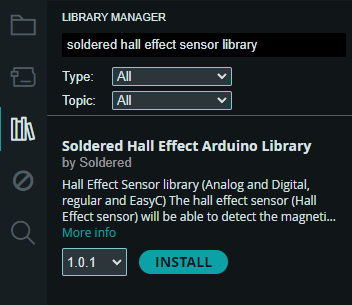
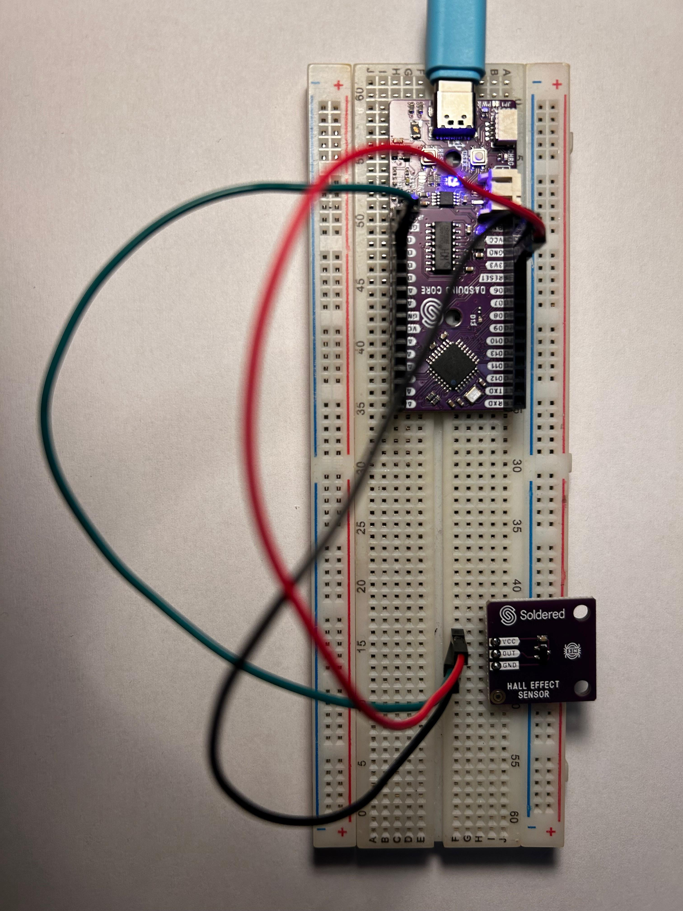
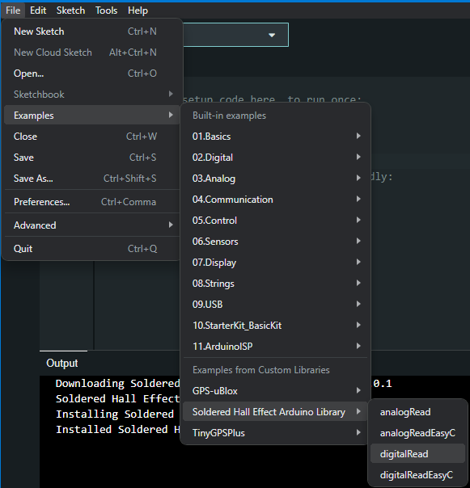
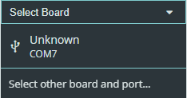
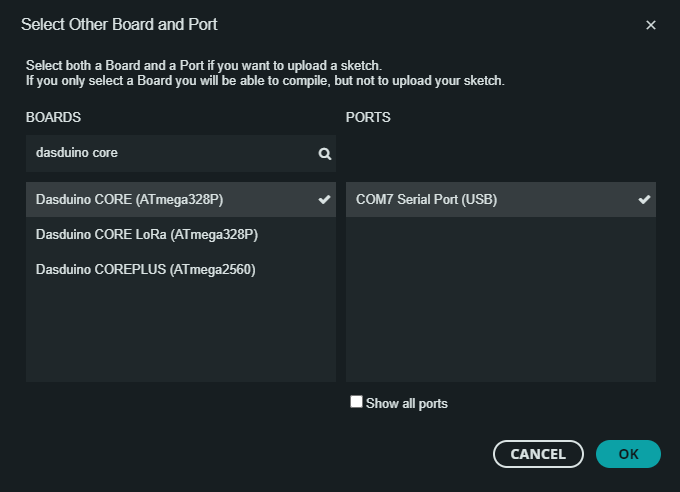
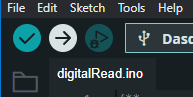
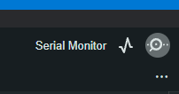

# Digital Hall Effect Sensor

## 1. Product Overview
---
|  |
| :----------------------------------------------------------------------------------: |
|     [Hall effect sensor breakout with digital output](https://solde.red/333080)      |

| SKU       | Product Name                           | Store Link | Solde.red Page |
|-----      |--------------                          |------------|----------------|
|  333080   |      Digital Hall Effect Sensor        |[View Store](https://soldered.com/product/hall-effect-sensor-breakout-with-digital-output/)| [View on solde.red](https://solde.red/333080)              |

If you've ever wanted to experiment with magnetic field detection, Hall Effect sensors are a great place to start. Hall Effect sensors are ideal for applications that require simple magnetic field sensing, such as measuring rotational speed, position detection and proximity sensing.
This Hall Effect sensor enables easy detection of magnetic field presence under the threshold distance. It operates on **3.3V** and requires up to **5mA** of current. The sensor is designed for seamless integration with microcontrollers and can be controlled directly through an arduino library

## 2. How it works
---
A Hall effect sensor consists of a thin rectangular semiconductive material (indium arsenide, gallium arsenide) through which flows a continuous current. When the sensor is exposed to a magnetic field perpendicular to the current, the magnetic (Lorentz) force deflect the charge carriers within the semiconductor. This deflection causes a difference in potentials, known as Hall Voltage, proportional to the strength of the magnetic field. The Hall Voltage generated is typically very small (in microvolts), so it is amplified by an internal high gain amplifier.

There are two types of Hall Effect sensors, the difference being in type of output value. **Analog** sensors provide a continuous output voltage proportional to the intensity of the magnetic field. They are used in applications where precise measuring is required. **Digital** sensors include a Schmitt Trigger circuit that compares the amplified Hall Voltage to preset thresholds. The outupt switches between ON and OFF states when magnetic field crosses these thresholds, it's ideal for applications such as proximity detection or position sensing.

## 3. Arduino: Getting Started
---
### Instaling the Arduino Library
In the Arduino Library Manager search for **Soldered Hall Effect Sensor Library**

| |
|:---:|
| Installing the Arduino library |  

### Conncetions 
Below is an example connection diagram for **Dasduino CORE**. These pins will be used in the examples throughout this documantation.

| |
|:---:|
| Hall Effect sensor connected to Dasduino CORE | 

| Dasduino core | Breakout Board |  
|:--:| :--:| 
| D5 | OUT |
|3V3| VCC |
|GND| GND |

## Arduino: Basic Example

### Running an example from Hall Effect Library
Open a new Sketch, then open  digitalRead Example from File -> Examples -> Soldered Hall Effect Arduino Library ->digitalRead.
|  |
| :---: |
| Path to the example |

To run example code click on **Select Board** dropdown menu

| |
| :---:|
|Contents of Select Board Dropdown menu |

note: if there are multiple COM ports listed, try unplugging your board from the computer and click on the menu again. COM port that dissapears is the one that will be used. In many cases, the COM port that has the biggest number in the name is usually the one we need.

Select both a Board and a Port to upload a sketch.
| |
| :---:|
|Contents of Select Board Dropdown menu |

To upload the code to the board, press the upload button in the upper left corner.
| |
| :---:|
|Upload Button |

Since the code uses serial communication, it is necessary to open the Serial Monitor to be able to check whether the code is working properly or not.

| |
| :---:|
|Serial Monitor |

If everything is done correctly, you should get smotehing like this:

| |
| :---:|

| |
| :---:|
